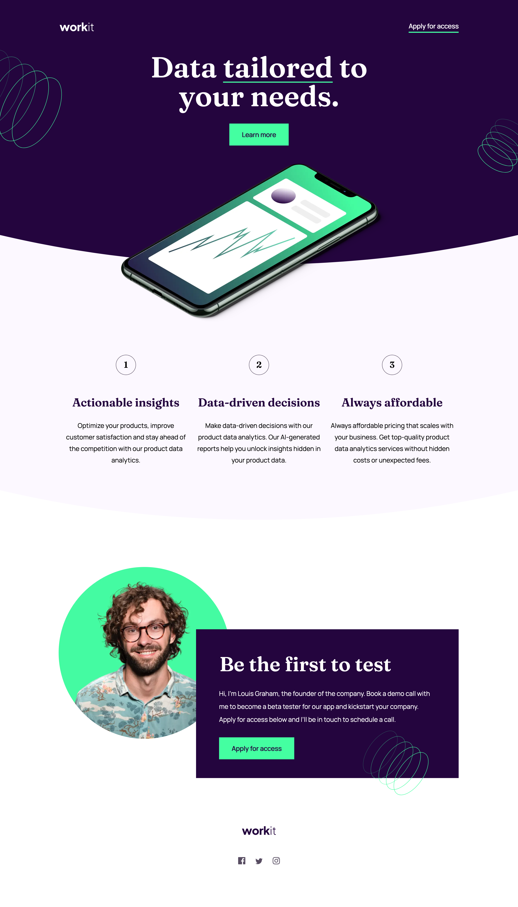

# Frontend Mentor - Workit landing page solution

This is a solution to the [Workit landing page challenge on Frontend Mentor](https://www.frontendmentor.io/challenges/workit-landing-page-2fYnyle5lu). Frontend Mentor challenges help you improve your coding skills by building realistic projects. 

# Table of contents

- [Overview](#overview)
  - [The challenge](#the-challenge)
  - [Screenshot](#screenshot)
  - [Links](#links)
- [My process](#my-process)
  - [Built with](#built-with)
  - [What I learned](#what-i-learned)
  - [Useful resources](#useful-resources)
- [Author](#author)
- [Acknowledgments](#acknowledgments)

# Overview

### The challenge

Users should be able to:

- View the optimal layout for the interface depending on their device's screen size
- See hover and focus states for all interactive elements on the page

### Screenshot



### Links

- Solution URL: [Add solution URL here](https://your-solution-url.com)
- Live Site URL: [Add live site URL here](https://your-live-site-url.com)

## My process

### Built with

- Semantic HTML5 markup
- CSS custom properties
- Flexbox
- CSS Grid

### What I learned

I learned how to make curved background using ::after.

To see how you can add code snippets, see below:

```html
<section class="hero">
  ...
  ...
</section>
```
```css
.hero::after {
   content: "";
   width: 300%;
   height: 0;
   padding-top: 200%;
   border-radius: 100%;
   background-color: #24053E;
   position: absolute;
   bottom: 28%;
   left: 50%;
   transform: translateX(-50%);
}
```

### Useful resources

- [Curved Background](https://codepen.io/cblanchard/pen/ooJLGO) - This helped me for creating a curved background.

## Author

- Frontend Mentor - [@ykwonmoon](https://www.frontendmentor.io/profile/kwonmoon)

## Acknowledgments

Google and ChatGPT